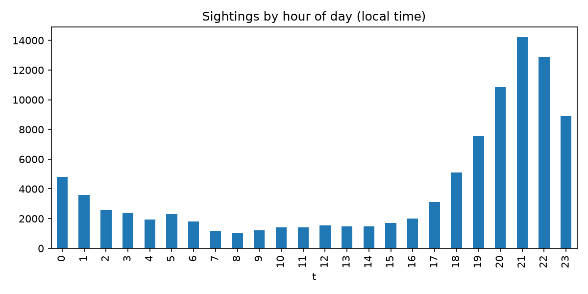

# AlienProg

Exploring about 97,000 UFO sighting reports from the
[National UFO Reporting Center (NUFORC)](https://nuforc.org/): when people see
things, what they think they saw, and whether the busiest days are real patterns
or one-off events.



## Quick start

```bash
pip install -r requirements.txt
python nuforg_site.py ufo_sightings.csv   # interactive report, opens in your browser
python program.py ufo_sightings.csv       # static PNG charts in nuforc_out/
```

Run the scripts from the repo folder, because outputs are written relative to the
current directory.

## What's in here

| File | Purpose |
|---|---|
| `ufo_sightings.csv` | The data: one row per sighting report (see [Data](#data)). |
| `nuforg_site.py` | Builds `nuforc_report.html`, an interactive report made with Chart.js. |
| `program.py` | Quick matplotlib charts saved to `nuforc_out/`, plus the busiest days printed to the terminal. |
| `timezones.py` | Converts the UTC timestamps to the witness's local time (used by both scripts). |
| `nuforc_report.html`, `nuforc_out/` | Pre-built outputs from the included CSV. |

## The interactive report

`nuforg_site.py` does all the number crunching in pandas, puts the results into
the page as JSON, and writes one self-contained HTML file. Chart.js loads from a
CDN, so you need an internet connection to view it. The report includes:

- **Sightings per year** from 1940 to 2023. Numbers take off in the late 1990s
  once online reporting started.
- **Average sightings for every calendar day**, from 1995 to 2022 (full years
  only). Years with zero sightings on a date count as zero, so every day is
  averaged over the same number of years.
- **Top days: recurring or one-off?** The 15 busiest calendar days, each labeled
  with a simple rule:
  - **Recurring**: above 2× the typical (median) day in at least half the years.
  - **One-off spike**: not recurring, but one year holds 20% or more of the
    date's total.
  - **Mixed**: everything else.

  This is a rough heuristic, not a statistical test.
- **Date detail**: pick any date, or click a table row, to see that date
  year by year against the typical-day line.
- Breakdowns **by month, hour of day, shape, and state**.

### What it finds

- **July 4 is the busiest day by far**, at about 7× a typical day, and above 2×
  the typical day in 18 of 28 years. Fireworks, sky lanterns and lots of people
  outdoors. New Year's Eve and Day follow the same pattern.
- **Nov 7, 2015**: about half of all Nov 7 reports come from that one evening,
  the night of a Trident missile test off the California coast.
- **Nov 16–17, 1999**: the Leonid meteor storm.
- Sightings peak at **about 9 pm local time** and during the summer months.

## Data

`ufo_sightings.csv` columns:

| Column | Notes |
|---|---|
| `reported_date_time` | When the sighting happened, in **UTC** (see below). |
| `reported_date_time_utc` | Identical to `reported_date_time` in this export. |
| `posted_date` | When NUFORC published the report. |
| `city`, `state`, `country_code` | Location. About 90% of reports are from the US. |
| `shape` | Shape as described by the witness (light, circle, triangle, fireball, …). |
| `reported_duration` | Free-text duration, e.g. `"15 mins"`. |
| `duration_seconds` | Duration parsed to seconds. **Hours are wrong** (see below). |
| `summary` | Short text description. |
| `has_images` | Whether the report came with images. |
| `day_part` | Sun position at the time: night, morning, afternoon, civil/nautical/astronomical dusk or dawn. |

Both scripts try several common column names, so they also work with other
NUFORC exports as long as the file has some date/time column.

### Known quirks

- **Timestamps are UTC.** Both scripts convert them back to local time with
  `timezones.py`, using each row's US state, Canadian province or country.
  Without this step, evening sightings spill into the next UTC day, and July 5
  looks busier than July 4. States that span two time zones use the zone where
  most people live, so a few border towns will be an hour off. About 760 rows
  from countries not in the lookup stay in UTC. You can check the conversion
  against `day_part`: after converting, 9:00 reports are almost all "morning"
  and 21:00 reports are almost all "night".
- **`duration_seconds` treats hours as days.** Every "1 hour" is stored as
  86,400 instead of 3,600. Minutes and seconds are correct. Neither script uses
  this column. If you need it, reparse `reported_duration` yourself.
- **2023 is a partial year** (data ends in May 2023), so the calendar-day
  analysis stops at 2022.
- **State counts aren't adjusted for population**, so California, Florida and
  Texas lead.
- `program.py`'s "top days" list averages only over years that have at least one
  sighting on that date, so it's a quick first look. `nuforg_site.py`'s numbers
  are the careful version.

## Requirements

Python 3.9+ with pandas and matplotlib (`requirements.txt`).
